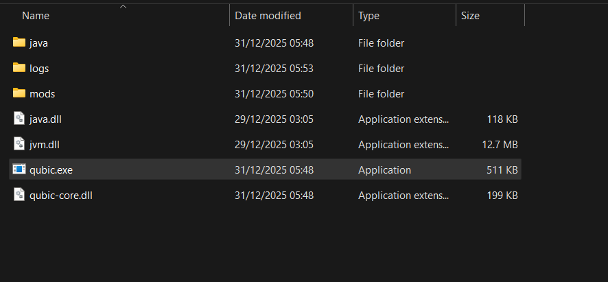
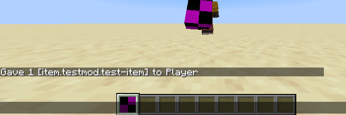
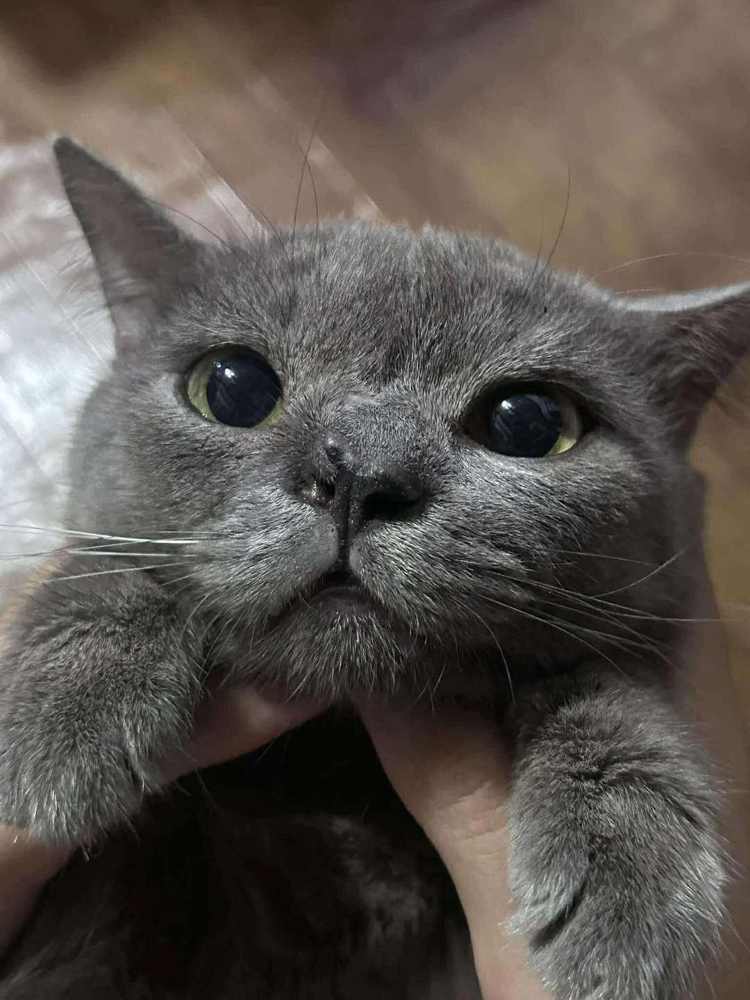

# QUBIC


# nothing much.. for now..
note:
> (this is still indev)

# DISCORD
**Join us to discuss and contribute to the project early:**
> https://discord.gg/yQdmGyUkpm

note:
> you will get an 'early member' role, after 1,000 - 2,000 people joined you will not be able to obtain it anymore..

# INFORMATION
heres an example of what a build of qubic-loader looks like:
 

note: 
> right now everything is hard-coded, (this is still indev)..<br>
> mod dlls/sos will be sandboxed in the future so they cant cause any harm<br>
> also yes i use makefile (may provide a cmake alternative in the future **OR** just switch completely, all-together)

# EXAMPLE OF API (as of 31/12/2025)

```cc
#include <qubic-api/inc/Qubic.hpp>

#include <qubic-api/inc/Registry/ItemRegistry.hpp>
#include <qubic-api/inc/Registry/BlockRegistry.hpp>
#include <qubic-api/inc/Registry/RegistryObject.hpp>

#include <cstdio>

struct TestMod final : public Qubic::BaseMod {
public:
    static constexpr const char* ID = "testmod";
    void init(Qubic::ModState* state) {
        printf("called init!\n");
        /* register items, max stack in minecraft is 99 (you will get a warning if you go over )*/
        Qubic::RegisterItem(state, "test-item", {128, "Test Item", ""});
        Qubic::RegisterItem(state, "other-item", {128, "Other Item", ""});
    }

    void on_tick(Qubic::ModState* state) {

    }
}; 

MOD_EXPORT Qubic::ModState* mod_load(Qubic::ModState* state) {
    printf("mod loaded!\n");
    TestMod* Mod = new TestMod();

    state->mod_id = TestMod::ID;
    state->data_ptr = Mod;
    
    printf("'%s' loaded!\n", TestMod::ID);

    Mod->init(state);

    return state;
}
```


note:
> this code creates two items <br>
> you can test this right now, but I wouldn’t really recommend it. its not very user-friendly yet; you can create items, but compiling and using it isn’t straightforward.

# KITTY


note:
> picture from r/catpics