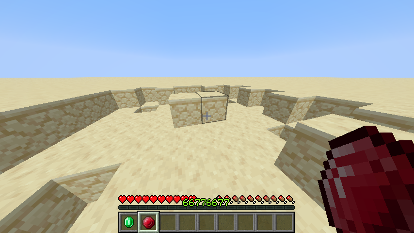
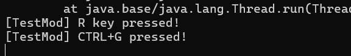
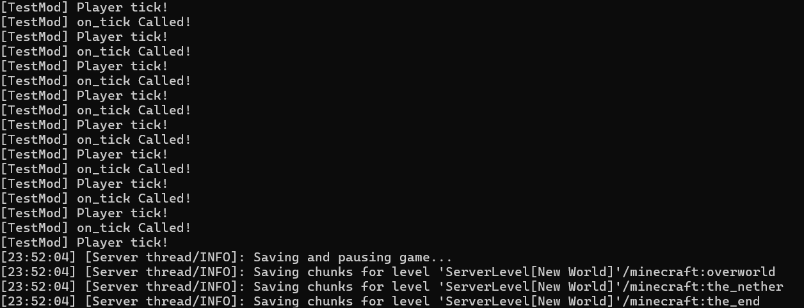

# QUBIC


# nothing much.. for now..
note:
> (this is still indev)

# DISCORD
**Join us to discuss and contribute to the project early:**
> https://discord.gg/yQdmGyUkpm

note:
> you will get an 'early member' role, after 1,000 - 2,000 people joined you will not be able to obtain it anymore..

# INFORMATION
heres an example of what a build of qubic-loader looks like:
 

note: 
> right now everything is hard-coded, (this is still indev)..<br>
> mod dlls/sos will be sandboxed in the future so they cant cause any harm<br>
> also yes i use makefile (may provide a cmake alternative in the future **OR** just switch completely, all-together)

# EXAMPLE OF API (as of 06/01/2026)

```cc
#include <qubic-api/inc/Qubic.hpp>

#include <qubic-api/inc/Registry/ItemRegistry.hpp>
#include <qubic-api/inc/Registry/BlockRegistry.hpp>
#include <qubic-api/inc/Registry/RegistryObject.hpp>

#include <qubic-api/inc/Event/PlayerJoinEvent.hpp>
#include <qubic-api/inc/Event/PlayerTickEvent.hpp>
#include <qubic-api/inc/Event/KeyInputEvent.hpp>

#include <qubic-api/inc/ActionContext/ItemActionContext.hpp> // IAC

#include <qubic-api/inc/Common/Player.hpp>

#include <cstdio>

void OnTestItemUse(Qubic::ItemActionContext* ctx) {
    printf("[TestMod] Item used!\n");
    printf("[TestMod] Player: %p\n", ctx->player);
    printf("[TestMod] World: %p\n", ctx->world);
    printf("[TestMod] ItemStack: %p\n", ctx->item_stack);
    printf("[TestMod] JNIEnv: %p\n", ctx->env);
    
    ctx->success = true;
    ctx->consume_item = false;
}

struct TestMod final : public Qubic::BaseMod {
public:
    static constexpr const char* ID = "testmod";
    
    void init(Qubic::ModState* state) override {
        Qubic::RegisterItem(state, "test_item",     { 64, "Test Item" });
        Qubic::RegisterItem(state, "other_item",    { 64, "Other Item", true });

        Qubic::RegisterItem(state, "ruby_item",     { 64, "Ruby"});

        Qubic::ItemDescriptor desc;
        desc.max_stack = 64;
        desc.name = "Callback Item";
        desc.on_use = OnTestItemUse;
        
        Qubic::RegisterItem(state, "callback_item", desc);
    }

    void on_tick(Qubic::ModState* state) override {
        printf("[TestMod] on_tick Called!\n");
    }

    void OnPlayerJoin(Qubic::PlayerJoinEvent* e) override {
        Qubic::Player player(e->player, e->env);
        
        printf("[TestMod] PLAYER JOINED\n");
        printf("[TestMod] Name: %s\n", player.GetName().c_str());
        
        auto pos = player.GetPosition();
        printf("[TestMod] Position: (%.2f, %.2f, %.2f)\n", pos.x, pos.y, pos.z);
        printf("[TestMod] Health: %.1f/%.1f\n", player.GetHealth(), player.GetMaxHealth());
        printf("[TestMod] Level: %d\n", player.GetExperienceLevel());
        printf("[TestMod] Creative: %s\n", player.IsCreative() ? "Yes" : "No");
        
        player.SendMessage("Welcome to the server!");
    }

    void OnPlayerTick(Qubic::PlayerTickEvent* e) override {
        printf("[TestMod] Player tick!\n");
    }
    
    void OnKeyInput(Qubic::KeyInputEvent* e) override {
        if (e->IsPress()) {
            if (e->key == QUBIC_KEY_R) {
                printf("[TestMod] R key pressed!\n");
                
                if (e->HasShift())
                    printf("[TestMod] With SHIFT modifier!\n");
            }
            
            if (e->key == QUBIC_KEY_G && e->HasCtrl())
                printf("[TestMod] CTRL+G pressed!\n");
        }
    }
}; 

MOD_EXPORT Qubic::ModState* mod_load(Qubic::ModState* state) {
    printf("mod loaded!\n");
    TestMod* Mod = new TestMod();

    state->mod_id = TestMod::ID;
    state->data_ptr = Mod;

    printf("'%s' loaded!\n", TestMod::ID);

    Mod->init(state);

    return state;
}
```




note:
> user input works (still wip)<br>
> events work (still wip)<br>
> texture loading for items work too (associating the item-id to the texture)<br>
> more to come soon!

# KITTY


note:
> picture from r/catpics